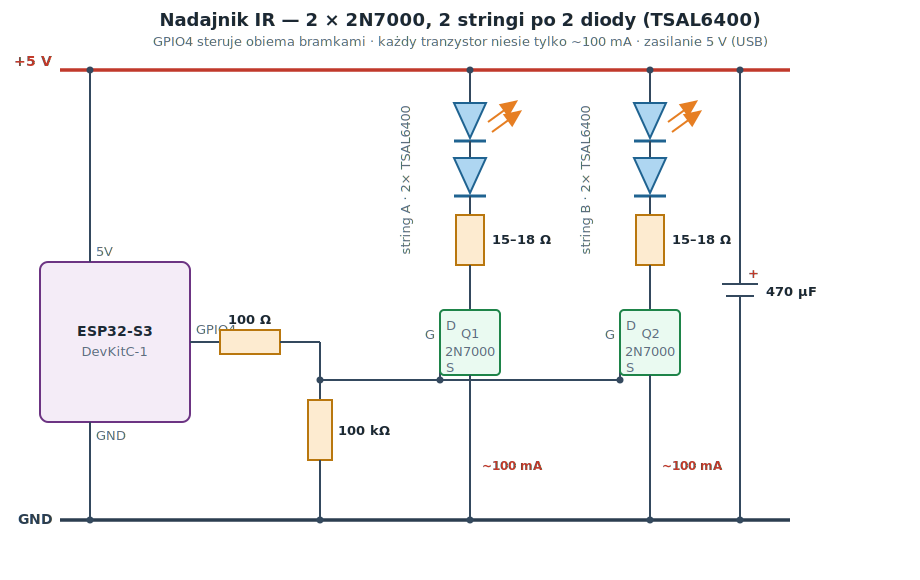

# Hardware — IR hub build

Wiring for the target build: a standalone IR hub controlling the Sencor MT9020C
(with room for more IR devices later). Brain is an **ESP32-S3-DevKitC-1**; IR
LEDs are driven by **two 2N7000 MOSFETs** (one per LED string), plus an optional
TSOP receiver for decoding real remotes.

> Confirmed working (2026-06-27): a single TSAL6400 on an ESP32-C6, driven by one
> 2N7000, powered from **3V3 through 10 Ω**, controls the real AC. That board has
> no usable 5 V pin (its `VIN` is a bare battery rail), so 3V3 was the fallback.
> The S3 build below uses its real **5 V** rail for full range.

## Bill of materials

| Part | Qty | Notes |
| ---- | --- | ----- |
| ESP32-S3-DevKitC-1 (N16R8) | 1 | any S3; N16R8 octal PSRAM blocks GPIO35/36/37 |
| TSAL6400 IR LED (940 nm) | 4 | two strings of 2 in series (aim different ways) |
| 2N7000 N-MOSFET | 2 | one low-side switch per string (~100 mA each) |
| Resistor 15–18 Ω | 1 per string (2) | LED current limit (~100 mA from 5 V) |
| Resistor 100 Ω | 1 | MOSFET gate series (shared by both gates) |
| Resistor 100 kΩ | 1 | MOSFET gate pulldown |
| Resistor 100 Ω | 1 | optional TSOP VCC filter |
| TSOP38238 / TSOP4838 | 1 | 38 kHz IR receiver (optional) |
| Ceramic 100 nF | 1–2 | TSOP + ESP decoupling |
| Electrolytic 470 µF / ≥16 V | 1 | 5 V bulk (IR/WiFi current spikes) |
| Enclosure (e.g. Kradex Z76) | 1 | LEDs poke **out** — black plastic blocks 940 nm |
| 5 V USB supply + cable | 1 | powers the board |

## Pin assignment

| ESP32-S3 | Use | Note |
| -------- | --- | ---- |
| **GPIO4** | IR TX (MOSFET gate) | safe pin |
| **GPIO5** | IR RX (TSOP OUT) | safe pin |
| **5V** (VBUS) | LED anodes + 470 µF | more range than 3V3 |
| **3V3** | TSOP VCC | **3.3 V, not 5 V** (keeps OUT at 3.3 V) |
| **GND** | common ground | several GND pins on the board |

Avoid: GPIO35/36/37 (octal PSRAM on N16R8), 0/45/46 (strapping), 19/20 (USB),
43/44 (UART0), 26–34 (SPI flash).

## Transmitter (TX) — two 2N7000, two series strings



Two identical strings in parallel; each string is **2 TSAL6400 in series** with its
own current-limit resistor and its own 2N7000 low-side switch. **GPIO4 drives both
gates** (through one shared 100 Ω, with a 100 kΩ pulldown so the LEDs stay off at
reset/boot). Plain-text version:

```
   +5V ─┬──────────┬──────────┬─────
        │          │          │
     [470µF]    LED (anode)  LED (anode)
        │       LED (series) LED (series)
       GND      [15-18Ω]     [15-18Ω]
                   │            │
                 DRAIN Q1     DRAIN Q2     2N7000 (flat face, legs down:
   GPIO4 ─[100Ω]─┬── GATE ──────┤ GATE      Source – Gate – Drain)
                 │  SOURCE Q1  SOURCE Q2
              [100kΩ]  │          │
                 │    GND ───────┴──── GND
                GND
```

### Why this topology

- **~100 mA per transistor, not 300 mA.** Series LEDs share one current, so each
  2N7000 carries only a single string (~100 mA) — well inside its 200 mA rating.
  Three LEDs in *parallel* on one 2N7000 would push ~300 mA through it.
- **2N7000 is not truly logic-level.** Its `R_DS(on)` is specced at `V_GS = 10 V`;
  driven from a 3.3 V gate it's only partly on, so a high-current load makes it a
  hot, lossy bottleneck. Keeping each device at ~100 mA sidesteps that. (For a
  single high-current path, a real logic-level FET — AO3400, IRLZ44N — is better,
  but this build reuses 2N7000s already on hand.)
- **Series pairs, not a triple.** Three TSAL6400 in series need `3 × 1.35 ≈ 4.05 V`
  (up to 4.8 V worst-case Vf) — on a ~4.8 V USB rail there's no headroom left for
  the resistor, so current collapses and gets unstable. **Two** in series leave
  ~1.6 V across the resistor — a healthy margin.
- **Resistor 15–18 Ω/string:** `(5 − 2×1.35 − ~0.7_FET) / 0.1 ≈ 16 Ω`. Only have
  10 Ω? Use `2×10 Ω = 20 Ω` (~80 mA); a bare 10 Ω gives ~160 mA (fine for pulsed IR
  but less margin).
- **More power?** Add more strings, each its own 2N7000 + resistor, all gates on
  GPIO4. IR is low-duty (carrier only during marks) so the average current is modest.

> Note on the schematic: where the gate bus crosses a source wire there is **no
> junction dot** — that's the standard "wires cross, not connected" convention.

## Receiver (RX) — TSOP (optional)

```
   3V3 ──┬──────────────► VCC ┐
         │                    │
      [100nF]              TSOP38238/4838
         │                    │
        GND ◄──────────────  GND
                              │
   GPIO5 ◄────────────────── OUT
```

- Power the TSOP from **3.3 V** so its OUT is 3.3 V (safe for the S3 GPIO).
- **100 nF right at the TSOP** (VCC↔GND, short legs) — without it the output is
  noisy (1 µs spikes that flood the receiver).
- Optional cleaner filter (datasheet): **100 Ω in series with VCC + 470 µF**.

## Power / decoupling

- **470 µF** between **5V and GND** near the LEDs — buffers IR/WiFi current spikes
  (prevents brownout).
- **100 nF** between **3V3 and GND** near the ESP.

## Bring-up order

1. **One LED, one 2N7000** to confirm the AC responds (already done on the C6):
   ```
   GPIO4 ─[100Ω]─ GATE 2N7000;  SOURCE → GND;  100kΩ gate→GND
   5V ─[15Ω]─ anode TSAL6400 ─ cathode → DRAIN     (or 3V3 ─[10Ω]─ if no 5 V pin)
   ```
   Wire the TSOP too (GPIO5 / 3V3 / GND / 100 nF) to verify the TX by loopback.
2. Works → build the **second string** and wire both per the schematic above (2
   strings × 2 series LEDs, both gates on GPIO4). Move to perfboard and mount in
   the enclosure with the LEDs poking through drilled holes.

## ESPHome (later)

`remote_transmitter` on **GPIO4** (carrier 38 kHz), `remote_receiver` on
**GPIO5**. For the N16R8: `board_build.arduino.memory_type: qio_opi`.
Protocol details: [`../docs/protocol.md`](../docs/protocol.md).
